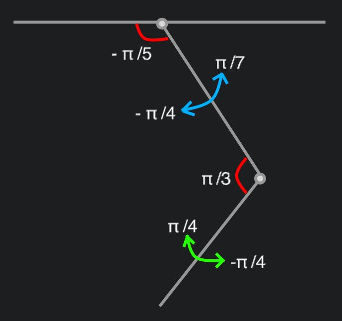

# Rex: an open-source domestic robot
This repository represent an experiment made using pyBullet and OpenAI Gym. It's a very work in progress project.

This project is mostly inspired by the incredible works done by Boston Dynamics.

The goal is to train a 3D printed legged robot using `Reinforcement Learning`. The aim is to let the robot learns 
domestic and generic tasks (like `pick objects` and `autonomous navigation`) in the simulations and then successfully
transfer the knowledge (Control policies) on the real robot without any other tuning.

# Installation
Create a `Python 3.7` virtual environment, e.g. using `Anaconda`
```
conda create -n rex python=3.7 anaconda
conda activate rex
```
## PyPI package
Install the `rex-gym` package:
```
pip install rex_gym
```

## Install from source
You can also clone this repository and install it using `pip`. From the root of the project:
```
pip install .
```

# Run pre-trained agent simulation
To start a pre-trained agent:

```
python rex_gym.playground.rex_reactive_env_play
```
There are also videos under `/videos`.

# Start a new training simulation
To start a new training session:

```
python -m rex_gym.agents.scripts.train --config rex_reactive --logdir YOUR_LOG_DIR_PATH 
```

`YOUR_LOG_DIR_PATH` sets where the policy output is stored. 

## PPO Agent configuration
You may want to edit the PPO agent's default configuration, especially the number of parallel agents launched in the simulation. 
Edit the `num_agents` variable in the `agents/scripts/configs.py` script:

```
def default():
    """Default configuration for PPO."""
    # General
    ...
    num_agents = 14
```
Install rex_gym from source. This configuration will launch 14 agents (threads) in parallel to train your model.

# Robot platform
The robot used for this experiment is the [Spotmicro](https://www.thingiverse.com/thing:3445283) made by [Deok-yeon Kim](https://www.thingiverse.com/KDY0523/about).

[](https://www.thingiverse.com/thing:3445283)

I've printed the components using a Creality Ender3 3D printer, with PLA and TPU+ (this last one just for the foot 
cover).

The idea is to extend the basic robot adding components like a 3 joints robotic arm on the top of the rack and a 
Lidar sensor.

# Rex: simulation engine
Rex is a 12 joints robot with 3 motors (`Shoulder`, `Leg` and `Foot`) for each leg. 
The Rex `pose signal` (see ```rex_reactive_env.py```) sets the 12 motor angles that make Rex stands up.

The robot model was imported in `pyBullet` creating an [URDF file](rex_gym/util/pybullet_data/assets/urdf/rex.urdf). 


# Tasks
This is a very first list of tasks I'd like to teach to Rex:

1. Locomotion - Run/Walk
2. Stand up
3. Reach a specific point
4. Autonomous navigation - Map environment
5. Grab an object

## Locomotion: Run
This task is about let Rex learns how to run in a open space. 
### Reinforcement Learning Algorithm
There is a good number of papers on quadrupeds locomotion, most of them comes with sample code. The most complete examples collection
 is probably the [Minitaur folder](https://github.com/bulletphysics/bullet3/tree/master/examples/pybullet/gym/pybullet_envs/minitaur) in the PyBullet3 repository. 
 This repository collects the code samples for the ```Sim-to-Real``` studies.
I've extracted and edited the ```Minitaur Reactive Environment```, sample code for the paper [Sim-to-Real: Learning Agile Locomotion For Quadruped Robots](https://arxiv.org/pdf/1804.10332.pdf), and used it 
to automate the learning process for the locomotion gait for Rex. I've tried to retain all the improvements introduced in that paper
 to overcome the Reality Gap. 

#### Galloping gait - from scratch
In this very first experiment, I let the system learn from scratch: I set the open loop component ```a(t) = 0``` and 
gave the feedback component large output bounds `[−0.5,0.5]` radians. The `leg model` (see ```rex_reactive_env.py```) 
forces legs and foots movements (positive or negative direction, depending on the leg) influencing the learning 
score and time. In this first version, the `leg model` holds the Shoulder motors in the start position (0 degrees).  

As in the Minitaur example, I choose to use Proximal Policy Optimization (PPO). 

I've ran a first simulation (~6M steps), the output `control policy` is in `/policies/galloping/-++-rex_reactive`. 


The emerged galloping gait shows the robot body tilled up and some unusual positions/movements (especially starting from the initial pose). The `leg model` needs improvements. 
The policy video is `policies/galloping/videos/rex-no-bounds.mp4`
#### Galloping gait - bounded feedback
To improve the gait, in this second simulation, I've worked on the `leg model`.

 

I set bounds for both `Leg` and `Foot` angles, keeping the `Shoulder` in the initial position.
I've ran the simulation (7M steps), the output `control policy` is in `/policies/galloping/bounded-rex_reactive`. 


The emerged gait looks more clear. The policy video is `policies/galloping/videos/rex-galloping.mp4`

# Credits
[Sim-to-Real: Learning Agile Locomotion For Quadruped Robots](https://arxiv.org/pdf/1804.10332.pdf) and all the related papers. Google Brain, Google X, Google DeepMind - Minitaur Ghost Robotics.

[Deok-yeon Kim](https://www.thingiverse.com/KDY0523/about) creator of SpotMini.

The great work with the robot platform rendering done by Florian Wilk with his SpotMicroAI.

