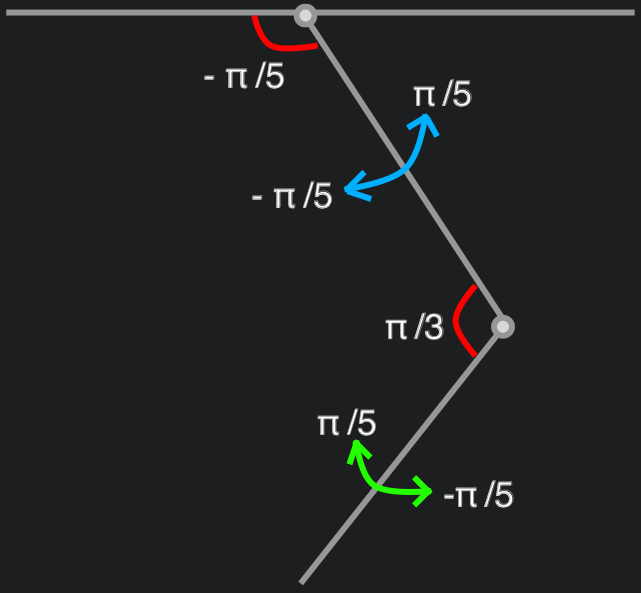
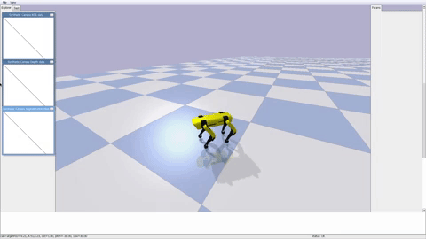
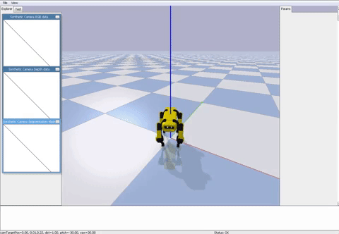
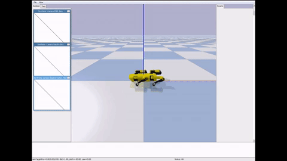

# Rex: an open-source domestic robot
The goal of this project is to train an open-source 3D printed quadruped robot exploring 
`Reinforcement Learning` and `OpenAI Gym`. The aim is to let the robot learns domestic and generic tasks in the simulations and then 
successfully transfer the knowledge  (`Control Policies`) on the real robot without any other manual tuning.

This project is mostly inspired by the incredible works done by Boston Dynamics.
## Related repositories
[rexctl](https://github.com/nicrusso7/rexctl) - A CLI application to bootstrap and control Rex running the trained `Control Policies`.

[rex-cloud](https://github.com/nicrusso7/rex-cloud) - A CLI application to train Rex on the cloud.

# Rex-gym: OpenAI Gym environments and tools
This repository contains different `OpenAI Gym Environments` used to train Rex, the Rex URDF model, 
the learning agent and some scripts to start the training session and visualise the learned `Control Polices`.

## Installation
Create a `Python 3.7` virtual environment, e.g. using `Anaconda`
```
conda create -n rex python=3.7 anaconda
conda activate rex
```

### PyPI package
Install the public `rex-gym` package:
```
pip install rex_gym
```

### Install from source
Alternately, clone this repository and run from the root of the project:
```
pip install .
```

# Run a pre-trained agent
To start a pre-trained agent:
```
python -m rex_gym.playground.policy_player --env ENV-NAME-HERE 
```

| Environment |     Flag      |
| ----------- | ------------- |
| Run         | rex_galloping |
| Walk        | rex_walk      |
| Turn        | rex_turn      |
| Stand up    | rex_standup   |

# Run single training simulation
To start a training simulation test (`agents=1`, `render=True`):
```
python -m rex_gym.playground.training_player --config rex_reactive --logdir YOUR_LOG_DIR_PATH
```
Where `YOUR_LOG_DIR_PATH` is the output path. 

Set the `Environment` with the `--config` flag:

| Environment |     Flag      |
| ----------- | ------------- |
| Run         | rex_galloping |
| Walk        | rex_walk      |
| Turn        | rex_turn      |
| Stand up    | rex_standup   |

# Start a new batch training simulation
To start a new batch training session:
```
python -m rex_gym.agents.scripts.train --config rex_reactive --logdir YOUR_LOG_DIR_PATH 
```
Where `YOUR_LOG_DIR_PATH` is the output path. 

Set the `Environment` with the `--config` flag:

| Environment |     Flag      |
| ----------- | ------------- |
| Run         | rex_galloping |
| Walk        | rex_walk      |
| Turn        | rex_turn      |
| Stand up    | rex_standup   |

## PPO Agent configuration
You may want to edit the PPO agent's default configuration, especially the number of parallel agents launched during 
the simulation.  

Edit the `num_agents` variable in the `agents/scripts/configs.py` script:

```
def default():
    """Default configuration for PPO."""
    # General
    ...
    num_agents = 20
```
Install rex_gym from source. This configuration will launch 20 agents (threads) in parallel to train your model.

# Robot platform
The robot used for this experiment is the [Spotmicro](https://www.thingiverse.com/thing:3445283) made by [Deok-yeon Kim](https://www.thingiverse.com/KDY0523/about).

[](https://www.thingiverse.com/thing:3445283)

I've printed the components using a Creality Ender3 3D printer, with PLA and TPU+.

The idea is to extend the robot adding components like a robotic arm on the top of the rack and a LiDAR sensor.

## Simulation model
Rex is a 12 joints robot with 3 motors (`Shoulder`, `Leg` and `Foot`) for each leg. 
The `poses signals` (see ```/model/rex.py```) set the 12 motor angles and allow Rex to stand up.

The robot model is imported in `pyBullet` using an [URDF file](rex_gym/util/pybullet_data/assets/urdf/rex.urdf). 


# Tasks
This is the list of tasks this experiment will cover:

1. Basic controls
    1. Run/Walk straight on - forward/backward
    2. Turn left/right on the spot
    3. Stand up/Sit down
    4. Steer - Run/Walk
    5. Side swipe
2. Fall recovery
3. Reach a specific point in a map
5. Grab an object

## Basic Controls: Run
Goal: how to run straight on. 
### Gym Environment
There is a good number of papers on quadrupeds locomotion, some of them with sample code. Probably, the most complete collection 
of examples is the [Minitaur folder](https://github.com/bulletphysics/bullet3/tree/master/examples/pybullet/gym/pybullet_envs/minitaur) in the Bullet3 repository. 
For this task, the ```Minitaur Reactive Environment``` explained in the paper [Sim-to-Real: Learning Agile Locomotion For Quadruped Robots](https://arxiv.org/pdf/1804.10332.pdf)
is a great example.

#### Galloping gait - from scratch
In this very first experiment, I let the system learn from scratch: giving the feedback component large output bounds `[−0.6,0.6]` radians.
The `leg model` (see ```galloping_env.py```) forces legs and foots movements (positive or negative direction, depending on the leg) influencing the learning 
score and time. In this first version, the `leg model` holds the Shoulder motors in the start position (0 degrees).  

As in the Minitaur example, I'm using the Proximal Policy Optimization (PPO). 


The emerged galloping gait shows the chassis tilled up and some unusual positions/movements (especially starting from the initial pose) during the locomotion. The `leg model` needs improvements. 

#### Galloping gait - bounded feedback
To improve the gait, in this second simulation, I've worked on the `leg model`:

 

I set bounds for both `Leg` and `Foot` angles, keeping the `Shoulder` in the initial position.


The emerged gait now looks more clear.

#### Galloping gait - balanced feedback
Another test was made using a balanced feedback:

 

The Action Space dimension is equals to 4, the same angle is assigned to both the front legs and a different one to the rear ones.
The very same was done for the foot angles.

The simulation score is massively improved (about 10x) as the learning time while the emerged gait is very similar to the `bounded feedback` model. 
The Tensorflow score with this model, after ~500k attempts, is the same after ~4M attempts using any other models.

## Basic Controls: Walk
Goal: how to walk straight on.
### Gym Environment
Starting from  [Minitaur Alternating Leg](https://github.com/bulletphysics/bullet3/blob/master/examples/pybullet/gym/pybullet_envs/minitaur/envs/minitaur_alternating_legs_env.py)
environment, I've used a sinusoidal signal as `leg_model` alternating the Rex legs during the locomotion. The feedback component has small 
bounds [-0.1,0.1] as in the original script. 



## Basic Controls: Turn left/right
Goal: How to reach a certain orientation turning on the spot.
### Gym Environment
In this environment the `leg_model` applies a 'steer-on-the-spot' gait, allowing Rex to moving towards a specific orientation. 
The reward function takes the chassis position/orientation and compares it with a fixed target position/orientation. 
When this difference is less than 0.1 radiant, the `leg_model` is set to the stand up. In order to make the learning more robust, 
the Rex starting orientation is randomly chosen (every 'Reset' step).



## Basic Controls: Stand up
Goal: Reach the base standing position starting from the rest position
### Gym Environment
This environment introduces the `rest_postion`, ideally the position assumed when Rex is in stand-by. 
The `leg_model` is the `stand_low` position, while the `signal` function applies a 'brake' forcing Rex to assume an halfway position 
before completing the movement.



# Credits
[Sim-to-Real: Learning Agile Locomotion For Quadruped Robots](https://arxiv.org/pdf/1804.10332.pdf) and all the related papers. Google Brain, Google X, Google DeepMind - Minitaur Ghost Robotics.

[Deok-yeon Kim](https://www.thingiverse.com/KDY0523/about) creator of SpotMini.

The great work in rendering the robot platform done by the [SpotMicroAI](https://github.com/FlorianWilk/SpotMicroAI) community.

