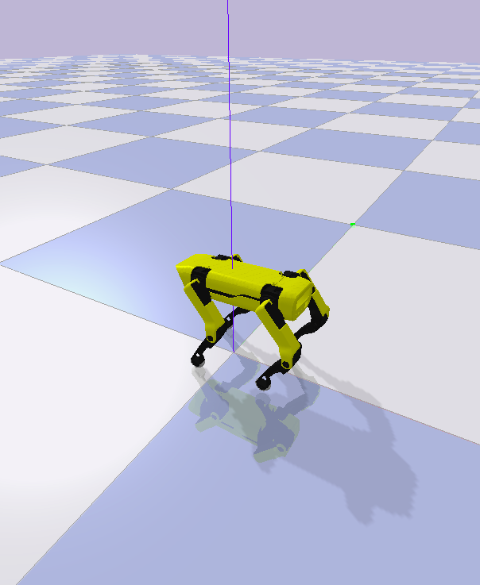
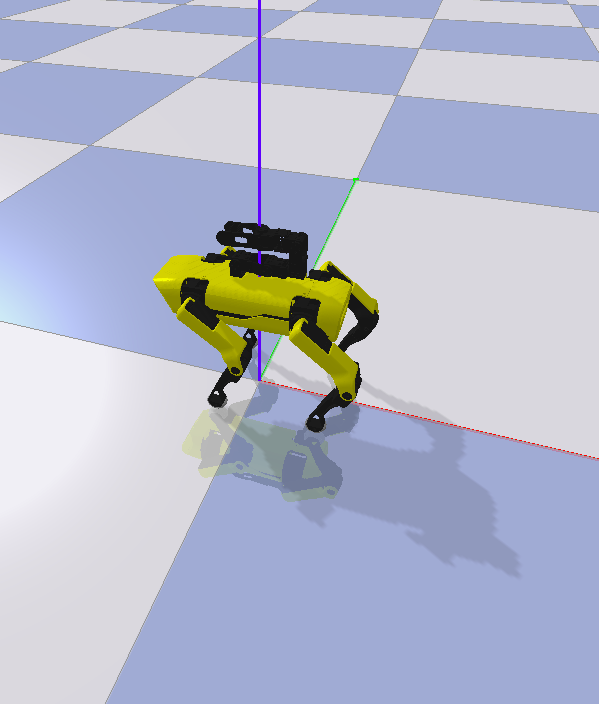
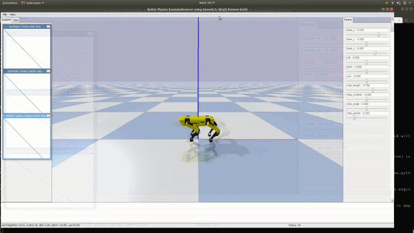
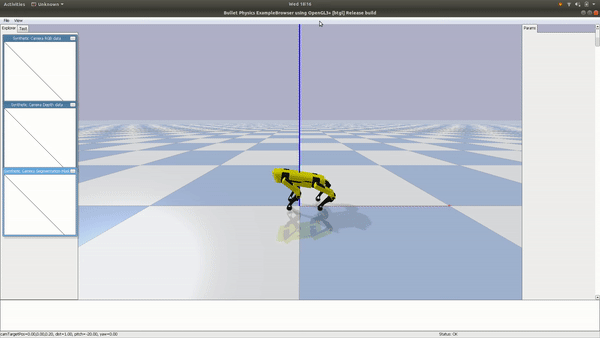
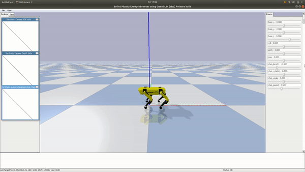
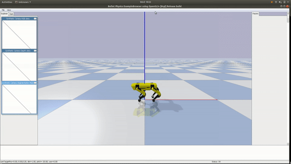
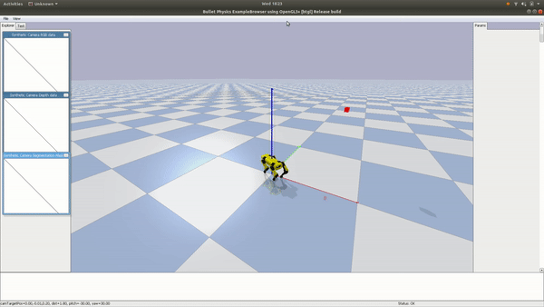
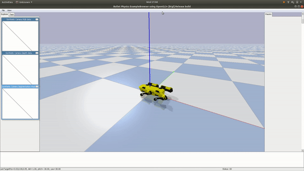

# Rex: an open-source quadruped robot


The goal of this project is to train an open-source 3D printed quadruped robot exploring 
`Reinforcement Learning` and `OpenAI Gym`. The aim is to let the robot learns domestic and generic tasks in the simulations and then 
successfully transfer the knowledge (`Control Policies`) on the real robot without any other manual tuning.

This project is mostly inspired by the incredible works done by Boston Dynamics.

## Related repositories
[rexctl](https://github.com/nicrusso7/rexctl) - A CLI application to bootstrap and control Rex robot running the trained `Control Policies`.

[rex-models](https://github.com/nicrusso7/rex-models) - A web URDF visualizer. Collection of Rex robot models. 

# Rex-gym: OpenAI Gym environments and tools
This repository contains a collection of `OpenAI Gym Environments` used to train Rex, the Rex URDF model, 
the learning agent implementation (PPO) and some scripts to start the training session and visualise the learned `Control Polices`.
This CLI application allows batch training, policy reproduction and single training rendered sessions.

# Installation
Create a `Python 3.7` virtual environment, e.g. using `Anaconda`
```
conda create -n rex python=3.7 anaconda
conda activate rex
```

## PyPI package
Install the public `rex-gym` package:
```
pip install rex_gym
```

## Install from source
Clone this repository and run from the root of the project:
```
pip install .
```

# CLI usage
Run ``` rex-gym --help ``` to display the available commands and ``` rex-gym COMMAND_NAME --help ``` to show the help 
message for a specific command.

Use the `--arg` flag to eventually set the simulation arguments. For a full list check out the [environments parameters](#environments-parameters).

To switch between the `Open Loop` and the `Bezier controller (inverse kinematics)` modes, just append either the `--open-loop` or `--inverse-kinematics` flags.
```
rex-gym COMMAND_NAME -ik
rex-gym COMMAND_NAME -ol
```
For more info about the modes check out [the learning approach](#learning-approach).

## Policy player: run a pre-trained agent
To start a pre-trained agent (play a learned `Control Policy`):
```
rex-gym policy --env ENV_NAME
```

## Train: Run a single training simulation
To start a single agent rendered session (`agents=1`, `render=True`):
```
rex-gym train --playground True --env ENV_NAME --log-dir LOG_DIR_PATH
```

## Train: Start a new batch training simulation
To start a new batch training session:
```
rex-gym train --env ENV_NAME --log-dir LOG_DIR_PATH
```

# Robot platform
## Mark 1
The robot used for this first version is the [Spotmicro](https://www.thingiverse.com/thing:3445283) made by [Deok-yeon Kim](https://www.thingiverse.com/KDY0523/about).

I've printed the components using a Creality Ender3 3D printer, with PLA and TPU+.


The hardware used is listed in this [wiki](https://github.com/nicrusso7/rexctl/wiki/Mark-I).

The idea is to extend the robot adding components like a robotic arm on the top of the rack and a LiDAR sensor in the next versions alongside 
fixing some design issue to support a better (and easier) calibration and more reliable servo motors.

# Simulation model

## Base model
Rex is a 12 joints robot with 3 motors (`Shoulder`, `Leg` and `Foot`) for each leg. 

The robot `base` model is imported in `pyBullet` using an [URDF file](rex_gym/util/pybullet_data/assets/urdf/rex.urdf). 

The servo motors are modelled in the `model/motor.py` class.



## Robotic arm
The `arm` model has the open source 6DOF robotic arm [Poppy Ergo Jr](https://github.com/poppy-project/poppy-ergo-jr) equipped on the top of the
rack.



To switch between `base` and `arm` models use the `--mark` flag.

# Learning approach
This library uses the `Proximal Policy Optimization (PPO)` algorithm with a hybrid policy defined as: 

```a(t, o) = a(t) + π(o)```

It can be varied continuously from fully user-specified to entirely learned from scratch. 
If we want to use a user-specified policy, we can set both the lower and the upper bounds of `π(o)` to be zero. 
If we want a policy that is learned from scratch, we can set `a(t) = 0` and give the feedback component `π(o)` a wide output range.

By varying the open loop signal and the output bound of the feedback component, we can decide how much user control is applied to the system. 

A twofold approach is used to implement the Rex `Gym Environments`: `Bezier controller` and `Open Loop`.

The `Bezier controller` implements a fully user-specified policy. The controller uses the `Inverse Kinematics` model (see `model/kinematics.py`) 
to generate the gait.

The `Open Loop` mode consists, in some cases, in let the system lean from scratch (setting the open loop component `a(t) = 0`) while others 
just providing a simple trajectory reference (e.g. `a(t) = sin(t)`).

The purpose is to compare the learned policies and scores using those two different approach.

# Tasks
This is the list of tasks this experiment want to cover:

1. Basic controls:
    1. **Static poses - Frame a point standing on the spot.**
    - [x] Bezier controller
    - [ ] Open Loop signal
    2. **Gallop**
        - forward
        - [x] Bezier controller
        - [x] Open Loop signal
        - backward
        - [ ] Bezier controller
        - [ ] Open Loop signal
    3. **Walk**
        - forward
        - [x] Bezier controller
        - [x] Open Loop signal
        - backward
        - [x] Bezier controller
        - [ ] Open Loop signal
    4. **Turn - on the spot**
     - [x] Bezier controller
     - [x] Open Loop signal
    5. **Stand up - from the floor**
    - [ ] Bezier controller
    - [x] Open Loop signal
2. Navigate uneven terrains:
    - [x] Random heightfield, hill, mount
    - [ ] Maze
    - [ ] Stairs
3. **Open a door**
4. **Grab an object**
5. **Fall recovery**
6. **Reach a specific point in a map**
7. **Map an open space**

# Terrains
To set a specific terrain, use the `--terrain` flag. The default terrain is the standard `plane`. This feature is quite useful to 
test the policy robustness.

## Random heightfield
Use the `--terrain random` flag to generate a random heighfield pattern. This pattern is updated at every 'Reset' step.


## Hills
Use the `--terrain hills` flag to generate an uneven terrain.


## Mounts
Use the `--terrain mounts` flag to generate this scenario.


## Maze
Use the `--terrain maze` flag to generate this scenario.


# Environments
## Basic Controls: Static poses
Goal: Move Rex base to assume static poses standing on the spot.

### Inverse kinematic
The gym environment is used to learn how to gracefully assume a pose avoiding too fast transactions.
It uses a one-dimensional `action space` with a feedback component `π(o)` with bounds `[-0.1, 0.1]`. 
The feedback is applied to a sigmoid function to orchestrate the movement.
When the `--playground` flag is used, it's possible to use the pyBullet UI to manually set a specific pose altering the robot base position 
(`x`,`y`,`z`) and orientation (`roll`, `pitch`, `jaw`).


## Basic Controls: Gallop
Goal: Gallop straight on and stop at a desired position.

In order to make the learning more robust, the Rex target position is randomly chosen at every 'Reset' step.

### Bezier controller
This gym environment is used to learn how to gracefully start the gait and then stop it after reaching the target position (on the `x` axis).
It uses two-dimensional `action space` with a feedback component `π(o)` with bounds `[-0.3, 0.3]`. The feedback component is applied to two ramp functions 
used to orchestrate the gait. A correct start contributes to void the drift effect generated by the gait in the resulted learned policy.   



### Open Loop signal
This gym environment is used to let the system learn the gait from scratch. The `action space` has 4 dimensions, two for the front legs and feet 
and two for the rear legs and feet, with the feedback component output bounds `[−0.3, 0.3]`.



## Basic Controls: Walk
Goal: Walk straight on and stop at a desired position.

In order to make the learning more robust, the Rex target position is randomly chosen at every 'Reset' step.

### Bezier controller
This gym environment is used to learn how to gracefully start the gait and then stop it after reaching the target position (on the `x` axis).
It uses two-dimensional `action space` with a feedback component `π(o)` with bounds `[-0.4, 0.4]`. The feedback component is applied to two ramp functions 
used to orchestrate the gait. A correct start contributes to void the drift effect generated by the gait in the resulted learned policy.

#### Forward
  

#### Backwards


### Open Loop signal
This gym environment uses a sinusoidal trajectory reference to alternate the Rex legs during the gait. 

```
leg(t) = 0.1 cos(2π/T*t)
foot(t) = 0.2 cos(2π/T*t)
```
The feedback component has very small bounds: `[-0.01, 0.01]`. A ramp function are used to start and stop the gait gracefully.



## Basic Controls: Turn on the spot
Goal: Reach a target orientation turning on the spot.

In order to make the learning more robust, the Rex start orientation and target are randomly chosen at every 'Reset' step.

### Bezier controller
This gym environment is used to optimise the `step_length` and `step_rotation` arguments used by the `GaitPlanner` to implement the 'steer' gait.
It uses a two-dimensional `action space` with a feedback component `π(o)` with bounds `[-0.05, 0.05]`.


### Open loop
This environment is used to learn a 'steer-on-the-spot' gait, allowing Rex to moving towards a specific orientation. 
It uses a two-dimensional `action space` with a small feedback component `π(o)` with bounds `[-0.05, 0.05]` to optimise the `shoulder` and `foot` angles
during the gait. 



## Basic Controls: Stand up
Goal: Stand up starting from the standby position
This environment introduces the `rest_postion`, ideally the position assumed when Rex is in standby. 

### Open loop
The `action space` is equals to 1 with a feedback component `π(o)` with bounds `[-0.1, 0.1]` used to optimise the signal timing. 
The signal function applies a 'brake' forcing Rex to assume an halfway position before completing the movement.



# Environments parameters
| Environment | `env` flag | `arg` flag |
| ----------- | ---------- | ---------- |
| Galloping | gallop | `target_position` |
| Walking | walk | `target_position` |
| Turn | turn | `init_orient`, `target_orient` |
| Stand up | standup | N.A |

| `arg` | Description |
| ----- | ----------- |
| init_orient | The starting orientation in rad. |
| target_orient | The target orientation in rad. |
| target_position | The target position (`x` axis). |

| Flags | Description |
| ----- | ----------- |
| log-dir | The path where the log directory will be created. (Required) |
| playground | A boolean to start a single training rendered session |
| agents-number | Set the number of parallel agents |

## PPO Agent configuration
You may want to edit the PPO agent's default configuration, especially the number of parallel agents launched during 
the simulation.  

Use the `--agents-number` flag, e.g. `--agents-number 10`.

This configuration will launch 10 agents (threads) in parallel to train your model.

The default value is setup in the `agents/scripts/configs.py` script:

```
def default():
    """Default configuration for PPO."""
    # General
    ...
    num_agents = 20
```

# Credits
## Papers 
[Sim-to-Real: Learning Agile Locomotion For Quadruped Robots](https://arxiv.org/pdf/1804.10332.pdf) and all the related papers. Google Brain, Google X, Google DeepMind - Minitaur Ghost Robotics.

[Inverse Kinematic Analysis Of A Quadruped Robot](https://www.researchgate.net/publication/320307716_Inverse_Kinematic_Analysis_Of_A_Quadruped_Robot)

[Leg Trajectory Planning for Quadruped Robots with High-Speed Trot Gait](https://www.researchgate.net/publication/332374021_Leg_Trajectory_Planning_for_Quadruped_Robots_with_High-Speed_Trot_Gait)

## Robot platform v1
[Deok-yeon Kim](https://www.thingiverse.com/KDY0523/about) creator of SpotMini.

The awesome [Poppy Project](https://github.com/poppy-project).

SpotMicro CAD files: [SpotMicroAI](https://github.com/FlorianWilk/SpotMicroAI) community.

## Inspiring projects
The kinematics model was inspired by the great work done by [Miguel Ayuso](https://hackaday.io/project/171456-diy-hobby-servos-quadruped-robot).

