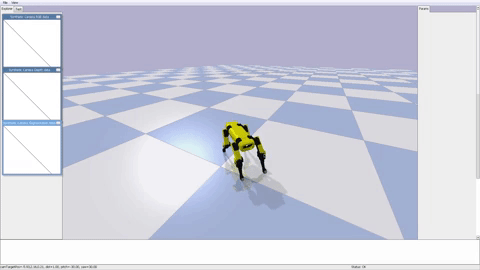

# Rex: an open-source domestic robot
This repository represent an experiment made using PyBullet3 and the OpenAI Gym framework. It's a very work in progress project.

This project is mostly inspired by the incredible works done by Boston Dynamics.

The goal is to train a 3D printed legged robot using `Reinforcement Learning`. The aim is to let the robot learns 
domestic and generic tasks (like `pick objects` and `autonomous navigation`) in the simulations and then successfully
transfer the knowledge (Control policies) on the real robot without any other tuning.

# Robot platform
The robot used for this experiment is the [Spotmicro](https://www.thingiverse.com/thing:3445283) made by [Deok-yeon Kim](https://www.thingiverse.com/KDY0523/about).
[](https://www.thingiverse.com/thing:3445283)

I've printed the components using a Creality Ender3 3D printer, with PLA and TPU+ (this last one just for the foot 
cover).

The idea is to extend the basic robot adding components like a 3 joints robotic arm on the top of the rack and a 
Lidar sensor.

# Physic simulation engine
The robot model was imported in PyBullet3 creating an [URDF file](./util/pybullet_data/assets/urdf/rex.urdf). I started 
from the great work done by [Florian Wilk](https://github.com/FlorianWilk) with his [SpotMicroAI](https://github.com/FlorianWilk/SpotMicroAI).


Rex is a 12 joints robot with 3 motors (Shoulder, Leg and Foot) for each leg. The Rex pose signal (see ```rex_reactive_env.py```)
  sets the 12 motor angles that make Rex stands up.
  
# Tasks
Here is a very first list of the tasks I'd like to teach to Rex:

1. Locomotion - Run
2. Locomotion - Walk
3. Reach a specific point
4. Autonomous navigation - Map environment
5. Grab an object

## Locomotion: Run
This task is about let Rex learns how to run in a open space. 
### Reinforcement Learning Algorithm
There is a good number of papers on quadrupeds locomotion, most of them comes with sample code. The most complete examples collection
 is probably the [Minitaur folder](https://github.com/bulletphysics/bullet3/tree/master/examples/pybullet/gym/pybullet_envs/minitaur) in the PyBullet3 repository. 
 This repository collects the code samples for the ```Sim-to-Real``` study (Google Brain, Google X, Google DeepMind - Minitaur Ghost Robotics).
I've extracted and edited the ```Minitaur Reactive Environment```, sample code for the paper [Sim-to-Real: Learning Agile Locomotion For Quadruped Robots](https://arxiv.org/pdf/1804.10332.pdf), and used it 
to automate the learning process for the locomotion gait for Rex. I've tried to retain all the improvements introduced in that paper
 to overcome the Reality Gap. 

In this very first experiment, I let the system learn from scratch: I set the open loop component ```a(t) = 0``` and 
gave the feedback component large output bounds [−0.5,0.5] radians. The `leg model` (see ```rex_reactive_env.py```) 
forces legs and foots movements (positive or negative direction, depending on the leg) influencing the learning 
score and time. In this first version, the `leg model` holds the Shoulder motors in the start position (0 degrees).  
As in the Minitaur example, I choose to use Proximal Policy Optimization (PPO). 

### Control policies
I've ran a first simulation (~6M steps), the output `control policy` is the `/policies` folder. 



The emerged gait can be improved, I need to increase the simulation steps (to at least 8M) and improve the `leg model`.